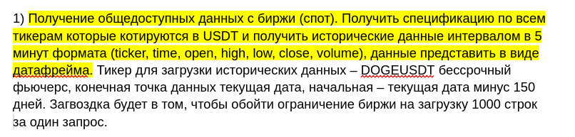

# qts-test

To install dependencies:

```bash
bun install
```
---
Запустить решение задачи 2 часть 1.1:

```bash
bun run src/task2_1.solution1.ts
```
---
Запустить решение задачи 2 часть 1.2:
```bash
bun run src/task2_1.solution2.ts
```
---
Запустить решение задачи 2 часть 2:
```bash
BINANCE_API_KEY=<your_binance_api_key> BINANCE_API_KEY_SECRET=<your_binance_api_key_secret> bun run src/task2_2.solution.ts
```
---
Запустить решение задачи 3:
```bash
bun run src/task3.solution.ts
```
---
Запустить решение задачи 4:
```bash
docker-compose up -d && while [[ "$(docker inspect -f '{{.State.Health.Status}}' db)" != "healthy" ]]; do echo 'waiting for db to initialize...'; sleep 3; done && echo 'db is up, now running task4 solution' && bun run src/task4.solution.ts
```
---

This project was created using `bun init` in bun v1.1.37. [Bun](https://bun.sh) is a fast all-in-one JavaScript runtime.
